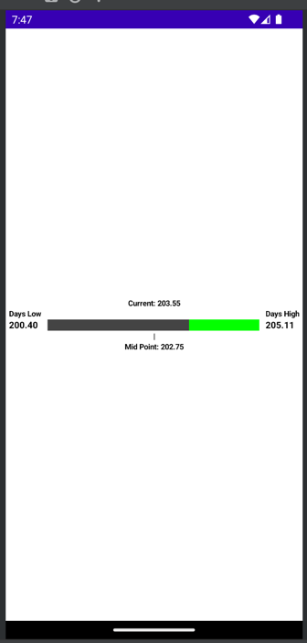

<h1>Value Range Bar Composable</h1>

<h3>
A Visual representation of the differences between a Low - Current - High value.</h3>


For example a Stock's Low Price, Current Price, and High Price of the day. Below is an Example with the values
Low: 200.40, Current: 203.55, High: 205.11. The Mid Point is marked on the bottom at
202.75.  

You can use the ValueRangeBar with Double, Int, or Long data types.

<h3>Usage</h3>


```kotlin

 import java.awt.Color// Basic Example using Double Values. Note that Doubles are set to 2 decimal places
@Composable
fun RangeBarExample() {
    Column(
        modifier = Modifier.fillMaxSize(),
        verticalArrangement = Arrangement.Center
    ){
        ValueRangeBar(
            settings = ValueRangeBarSettings.DoubleValueRange(
                modifier = Modifier.wrapContentHeight(),
                highValue = 205.11,
                highLabel = "Days High",
                curValue = 203.55,
                lowValue = 200.40,
                lowLabel = "Days Low",

            )
        )
    }
}

// Basic example using Int values.
@Composable
fun RangeBarExample() {
    Column(
        modifier = Modifier.fillMaxSize(),
        verticalArrangement = Arrangement.Center
    ){
        ValueRangeBar(
            settings = ValueRangeBarSettings.IntValueRange(
                modifier = Modifier.wrapContentHeight(),
                highValue = 205,
                highLabel = "Days High",
                curValue = 203,
                lowValue = 200,
                lowLabel = "Days Low",

                )
        )
    }
}

// More settings are available to use in the ValueRangeBarSettings classes.
// This is the ValueRangeBarSettings.DoubleValueRange class's available settings.
// Each of the ValueRangeBarSettings classes are the same except for their value inputs.
data class DoubleValueRange(
    val modifier: Modifier,
    val highValue: Double,
    val highLabel: String,
    val curValue: Double,
    val lowValue: Double,
    val lowLabel: String,
    val barHeight: Dp = 15.dp,
    val highSideColor: Color = Color.DarkGray,
    val lowSideColor: Color = Color.Green,
    val valueFontSize: TextUnit = 12.sp,
    val labelFontSize: TextUnit = 10.sp,
    val fontColor: Color = Color.Black,
    val fontFamily: FontFamily = FontFamily.Default,
    val showTopCurValue: Boolean = true,
    val showMidPoint: Boolean = true
): ValueRangeBarSettings()

```


